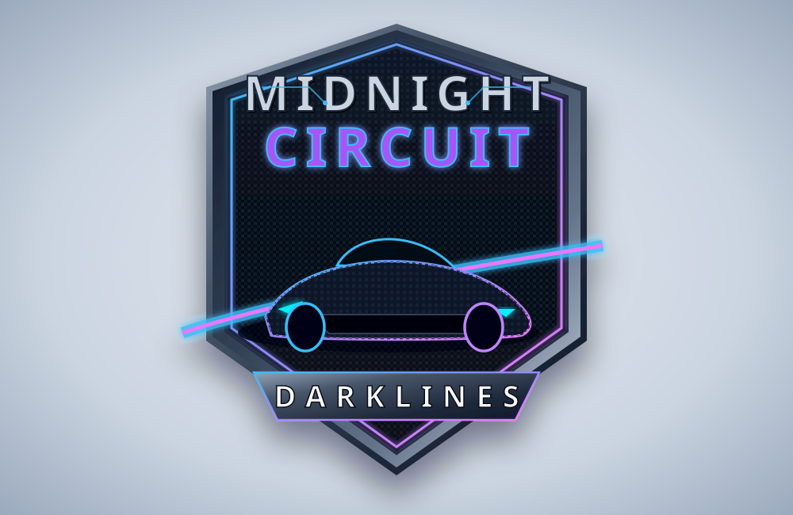

<p align="center">
  
</p>

<h1 align="center">MIDNIGHT CIRCUIT : DARKLINES</h1>

<p align="center">
  <strong>Next-Generation WebGL 3D Driving Simulator & VR38DETT Engine Acoustic Synthesizer</strong>
</p>

---

## 🏎️ About Midnight Circuit: Darklines

**Midnight Circuit: Darklines** is an ultra-high-fidelity 3D driving simulator built entirely for web browsers using Three.js and the Web Audio API. Experience the raw adrenaline of a JDM Nissan GT-R R35 navigating a dark industrial circuit under midnight sodium spotlights and flickering neon lights.

---

## ✨ Key Features

### 🔊 Procedural Web Audio Engine Synthesizer
* **VR38DETT V6 Combustion Acoustics**: Real-time synthesized engine sound modeling exact V6 firing orders (1.5x, 3x, 6x, and 9x RPM harmonics).
* **Turbocharger & Blow-Off Valve (BOV)**: Dynamic spool lag, turbine whistle tracking manifold pressure, and atmospheric compressor surge pops upon throttle lift.
* **Exhaust Manifold Saturation**: Non-linear acoustic wave-shaping with dynamic lowpass filtering, backfire pops at redline, and acoustic cavity resonance.

### 🚗 Realistic Vehicle Dynamics & Physics
* **Custom Rigid-Body Dynamics**: 4-wheel friction torque, weight transfer under acceleration/braking, dynamic steering geometry, and high-speed stability control.
* **6-Speed Dual-Clutch Transmission**: Realistic gear ratios, automatic clutch engagement, reverse gear (`R`), park (`P`), and Launch Control (`LC`).
* **Launch Control System**: Hold Brake + Throttle at standstill to spool turbo boost to 1.35 BAR, then release brake for instantaneous catapult acceleration!

### 🏎️ JDM Right-Hand Drive (RHD) First-Person Cockpit
* **1:1 Chassis-Locked Camera**: Seated driver perspective locked directly to the chassis frame with speed and RPM micro-vibrations.
* **Live 1024×512 HD Instrument Cluster**: High-resolution digital/analog twin gauges displaying real-time Tachometer (0–8,000 RPM), Speedometer (0–320 KM/H), Gear indicator, and Turbo Boost (BAR).
* **RHD Steering Wheel & Paddle Shifters**: Animated steering wheel with red anodized GT-R emblem badge and titanium shift paddles.

### 🌃 Cyberpunk Industrial World & Lighting
* **Midnight Circuit Environment**: Asphalt track with directional tire wear, industrial garage with animated roller shutter doors, flickering ceiling light fixtures, and perimeter neon walls.
* **Dynamic Projection Headlights**: High-intensity forward projection cone lights illuminating road markings and track obstacles.

### 📱 Progressive Web App (PWA)
* **Offline Playability**: Fully cached service workers allow full gameplay without an active internet connection.
* **Cross-Platform**: Install as a standalone native-feeling desktop app or add to mobile home screens.

---

## 🎮 Controls

| Action | Keyboard Key | Mobile Touch |
| :--- | :--- | :--- |
| **Throttle / Accelerate** | `W` or `Up Arrow` | Touch On-Screen Pedal |
| **Brake / Reverse** | `S` or `Down Arrow` | Touch On-Screen Brake |
| **Steer Left** | `A` or `Left Arrow` | Steering Buttons / Gyro |
| **Steer Right** | `D` or `Right Arrow` | Steering Buttons / Gyro |
| **Handbrake (Drift)** | `Spacebar` | On-Screen Handbrake |
| **Start / Stop Engine** | `E` | Engine Start Button |
| **Toggle Camera View** | `V` | Cam Button |
| **Headlights Toggle** | `L` | Lights Button |
| **Toggle Mute Audio** | `M` | Audio Indicator |
| **Return to Garage** | `G` | Garage Button |
| **Garage Gate Open / Enter** | `Enter` | On-Screen Prompt |

---

## 🛠️ Tech Stack

* **Rendering Engine**: Three.js (WebGL)
* **Audio System**: Web Audio API (Multi-Harmonic Synthesizer)
* **Styling & UI**: Tailwind CSS
* **Build System**: Vite & TypeScript
* **PWA**: Web App Manifest & Service Worker

---

## 🚀 Getting Started

### Prerequisites
* Node.js (v18 or higher recommended)
* npm or bun

### Local Development Setup

1. **Install Dependencies**:
   ```bash
   npm install
   ```

2. **Run Development Server**:
   ```bash
   npm run dev
   ```
   Open your browser and navigate to `http://localhost:3000`.

3. **Build for Production**:
   ```bash
   npm run build
   ```

---

<p align="center">
  Designed & Built for High-Performance Browser Gaming
</p>
